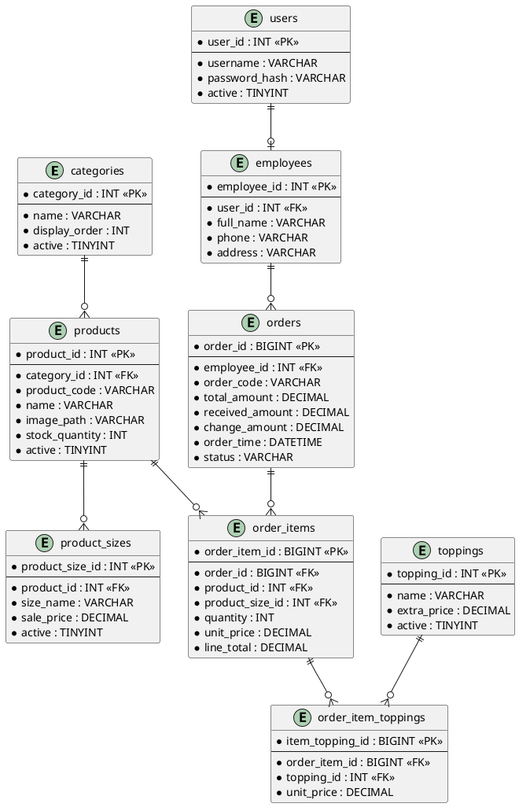
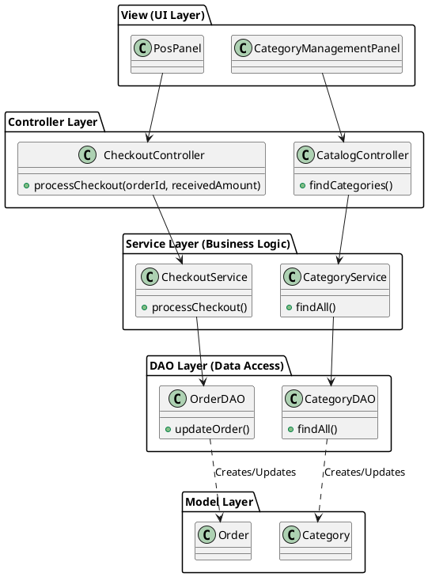
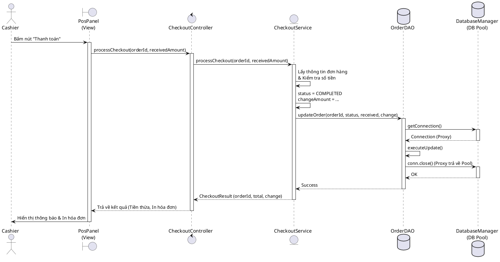
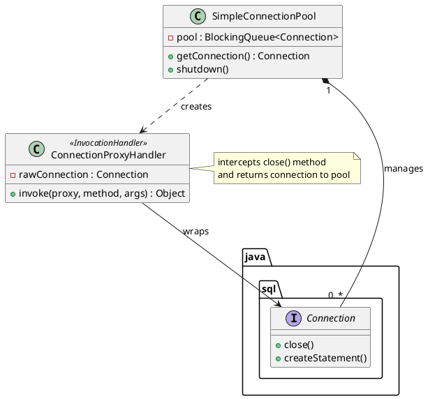
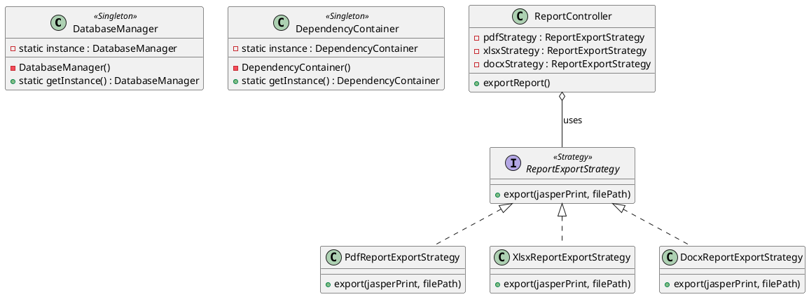

# CHƯƠNG 3. PHÂN TÍCH THIẾT KẾ HỆ THỐNG

Việc thiết kế một hệ thống không chỉ nằm ở việc giải quyết bài toán hiện tại mà còn phải đảm bảo khả năng mở rộng trong tương lai. Chương này là minh chứng rõ nét nhất cho việc ứng dụng các lý thuyết Kỹ thuật Phần mềm (Software Engineering) vào thực tế dự án. Chúng em xin trình bày chi tiết về cách thiết kế Cơ sở dữ liệu, Kiến trúc Lớp (Class Diagram) và đặc biệt là phân tích sâu các Mẫu thiết kế (Design Patterns) mang tính nền tảng.

## 3.1. Thiết kế Dữ liệu và Kiến trúc Tổng quan

### 3.1.1. Sơ đồ Thực thể - Mối kết hợp (ERD)
Dữ liệu của hệ thống được chuẩn hóa chặt chẽ theo dạng chuẩn 3NF (Third Normal Form) nhằm loại bỏ sự dư thừa dữ liệu và đảm bảo tính toàn vẹn thông tin bán hàng. Sơ đồ Thực thể - Mối kết hợp (Entity-Relationship Diagram - ERD) dưới đây minh họa rõ nét các bảng cốt lõi đóng vai trò xương sống cho hoạt động của cửa hàng. Bảng `orders` đóng vai trò là bảng trung tâm lưu trữ thông tin về các giao dịch bán hàng, liên kết chặt chẽ với bảng `order_items` để quản lý chi tiết các món hàng mà khách hàng đã chọn. Để hỗ trợ các sản phẩm phức tạp trong ngành F&B (ví dụ: trà sữa có nhiều kích cỡ và nhiều loại topping), bảng `order_items` tiếp tục có quan hệ với các thực thể liên quan thông qua các khóa ngoại (Foreign Keys).

### 3.1.2. Sơ đồ Lớp mô hình MVC và DAO (Kiến trúc gói theo Tính năng)
Không giống như các đồ án cấp thấp thường tổ chức toàn bộ mã nguồn vào chung một thư mục, dự án này áp dụng mô hình phân tách 4 lớp kinh điển: Tầng giao diện (View Layer), Tầng điều khiển (Controller Layer), Tầng xử lý nghiệp vụ (Service Layer) và Tầng truy xuất dữ liệu (DAO Layer). Đặc biệt, cấu trúc thư mục được thiết kế dưới dạng **Package by Feature** (Gói theo Tính năng), giúp mã nguồn liên quan đến "Thanh toán" nằm chung một chỗ, giúp lập trình viên cực kỳ dễ dàng tìm kiếm và nâng cấp mã nguồn sau này. Sơ đồ sau mô tả luồng kiểm soát phụ thuộc một chiều, trong đó lớp cấp cao không bao giờ bị phụ thuộc ngược bởi lớp cấp thấp.

## 3.2. Thiết kế Luồng nghiệp vụ và Ứng dụng Design Patterns

### 3.2.1. Sơ đồ Tuần tự: Quy trình Thanh toán (Checkout Call Flow)
Để giảng viên có một cái nhìn trực quan về cách ứng dụng vận hành từ đầu đến cuối, chúng em chọn quy trình cốt lõi nhất của mọi hệ thống bán lẻ: **Quá trình Thanh toán (Checkout)**. Sơ đồ Tuần tự (Sequence Diagram) sau đây mô tả rõ ràng luồng tương tác giữa nhân viên thu ngân và toàn bộ 4 lớp kiến trúc của hệ thống, dẫn đến việc cập nhật trạng thái đơn hàng xuống cơ sở dữ liệu.

Đáng chú ý trong sơ đồ này là sự can thiệp của `Proxy Connection` khi tương tác với Database. Khác với cách mở/đóng kết nối vật lý thông thường gây chậm chạp hệ thống, ứng dụng sẽ lấy một kết nối đã được mở sẵn từ Pool. Sau khi lệnh `executeUpdate()` thành công, lệnh đóng kết nối `conn.close()` sẽ bị đánh chặn để không tắt kết nối vật lý, mà chỉ ngầm định trả nó lại vào trong ngăn chứa (Pool) chờ lệnh tiếp theo.

### 3.2.2. Tối ưu hệ thống bằng Design Patterns (Các Mẫu Thiết Kế Xuất Sắc)
Một kỹ sư phần mềm thực thụ không chỉ biết cách giải bài toán mà còn phải biết giải chúng một cách thanh lịch và tối ưu hiệu suất. Việc áp dụng thành thạo các Mẫu thiết kế (Design Patterns) - tài liệu kinh điển của bộ tứ GoF (Gang of Four) - chính là điểm sáng giá nhất của đồ án này.

**1. Sự kết hợp hoàn hảo giữa Object Pool và Dynamic Proxy Pattern**
Trong kiến trúc phần mềm kết nối cơ sở dữ liệu (Database), thao tác tốn kém thời gian và tài nguyên CPU nhất chính là thao tác mở kết nối (Opening a physical TCP connection). Nếu một cửa hàng có nhiều giao dịch, việc cứ một giao dịch lại gọi hàm kết nối tới cơ sở dữ liệu và ngay sau đó đóng lại sẽ khiến ứng dụng chạy cực kỳ chậm và dễ dẫn đến nghẽn cổ chai (Bottleneck). 

Để khắc phục vấn đề chí mạng này, nhóm đã xây dựng một **Object Pool Pattern** mang tên `SimpleConnectionPool`. Ngay khi ứng dụng vừa khởi động, hệ thống âm thầm mở sẵn một số lượng kết nối (Eager Initialization). Bất kỳ DAO nào cần kết nối sẽ đến Pool để mượn thay vì tự tạo mới.

Tuy nhiên, bài toán đặt ra là: Lập trình viên thường có thói quen gọi hàm `conn.close()` sau khi dùng xong (theo chuẩn Java try-with-resources). Nếu gọi `close()` thì kết nối vật lý sẽ bị hủy diệt, phá hỏng mục tiêu của Pool! Nhóm đã áp dụng cực kỳ khéo léo kỹ thuật **Dynamic Proxy Pattern** thông qua lớp `ConnectionProxyHandler`. Đối tượng kết nối trả về cho lập trình viên thực chất là một "người đại diện" (Proxy). Bất cứ khi nào lập trình viên gọi lệnh `close()`, Proxy này sẽ đánh chặn sự kiện (Intercept) và thay vì hủy kết nối, nó nhấc kết nối đó ném lại vào hàng đợi `BlockingQueue` của Pool để chờ phục vụ người tiếp theo. Đây là một cơ chế xử lý dưới nền vô cùng tinh tế và mạnh mẽ.

**2. Tiết kiệm bộ nhớ với Singleton Pattern và linh hoạt xuất báo cáo với Strategy Pattern**
- **Singleton Pattern:** Trong ứng dụng, có những đối tượng bắt buộc phải duy trì tính duy nhất trên toàn hệ thống để tránh lãng phí bộ nhớ và đảm bảo tính đồng bộ dữ liệu. `DatabaseManager` là nơi quản lý hệ thống Pool, nếu bị khởi tạo nhiều lần sẽ gây bùng nổ kết nối dẫn đến sập server. Lớp `DependencyContainer` (như một IoC Container) chứa đựng toàn bộ các instance của Controller và Service. Pattern này được hiện thực hóa bằng việc dùng từ khóa `private` cho hàm khởi tạo (Constructor) và dùng biến tĩnh (static) kết hợp với từ khóa `synchronized` nhằm đảm bảo an toàn tuyệt đối ngay cả khi có nhiều luồng (Thread) truy cập cùng lúc.
- **Strategy Pattern:** Việc xuất báo cáo (Report) là một bài toán rất phổ biến nhưng lại hay thay đổi. Chủ cửa hàng có thể yêu cầu xuất báo cáo định dạng PDF hôm nay, nhưng ngày mai lại cần định dạng Excel (XLSX) hoặc Word (DOCX). Thay vì viết hàng loạt các khối lệnh `if-else` lộn xộn trong Controller, hệ thống định nghĩa một khuôn mẫu hành vi (Interface) chung là `ReportExportStrategy`. Các chiến lược xuất file cụ thể sẽ đóng vai trò là các lớp con độc lập. Ứng dụng sẽ có khả năng tùy biến định dạng xuất ra vào thời điểm chạy (runtime) một cách vô cùng uyển chuyển.

