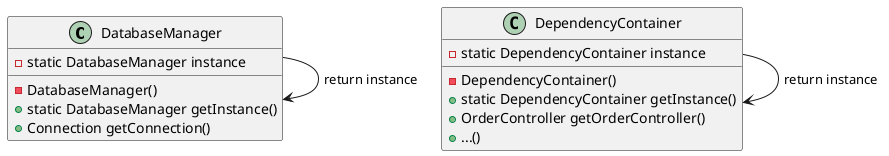

# 1. Singleton Pattern

## 1. Mục đích sử dụng
Đảm bảo rằng một lớp (class) chỉ có duy nhất một thể hiện (instance) được tạo ra trong suốt vòng đời của ứng dụng, đồng thời cung cấp một điểm truy cập toàn cục (global access point) để các thành phần khác có thể sử dụng thể hiện đó.

## 2. Vị trí áp dụng trong hệ thống
Mẫu thiết kế này được áp dụng chủ yếu cho các lớp quản lý kết nối cơ sở dữ liệu và quản lý các dependency (phụ thuộc) dùng chung cho toàn bộ ứng dụng, nhằm tiết kiệm tài nguyên bộ nhớ và tránh việc khởi tạo đi khởi tạo lại nhiều lần các thành phần nặng nề.

## 3. Cấu trúc lớp
### Các lớp thực tế trong codebase:
- `com.brewpoint.pos.database.DatabaseManager`: Quản lý cấu hình và Pool kết nối cơ sở dữ liệu.
- `com.brewpoint.pos.DependencyContainer`: Chứa và khởi tạo toàn bộ DAO, Service, và Controller của ứng dụng.

### Sơ đồ PlantUML:

## 4. Luồng hoạt động
- Constructor của lớp được đặt ở mức độ truy cập `private` để ngăn chặn việc khởi tạo đối tượng bằng từ khóa `new` từ bên ngoài.
- Lớp cung cấp một phương thức tĩnh (ví dụ `getInstance()`). Lần đầu tiên phương thức này được gọi, nó sẽ khởi tạo một đối tượng duy nhất và lưu vào một biến `static`.
- Từ các lần gọi sau trở đi, phương thức `getInstance()` sẽ trả về chính đối tượng đã được khởi tạo ban đầu đó. Cả `DatabaseManager` và `DependencyContainer` đều được sử dụng từ khóa `synchronized` để đảm bảo an toàn luồng (thread-safe) trong trường hợp có nhiều luồng cùng truy cập đồng thời ở lần khởi tạo đầu tiên.

## 5. Lợi ích đạt được
- **Tiết kiệm tài nguyên:** Tránh việc phải cấp phát lại bộ nhớ và thực hiện các thao tác tốn kém (như mở kết nối database hay khởi tạo toàn bộ service/dao) nhiều lần.
- **Dễ dàng quản lý trạng thái:** Vì chỉ có một phiên bản tồn tại, mọi thay đổi trạng thái đều nhất quán trên toàn bộ hệ thống.
- **Truy cập thuận tiện:** Các lớp khác trong hệ thống có thể lấy instance ở bất cứ đâu thông qua phương thức `getInstance()`.

## 6. Hạn chế
- **Gây khó khăn cho kiểm thử (Testing):** Do Singleton lưu giữ trạng thái toàn cục (global state), việc viết Unit Test có thể khó khăn vì trạng thái của bài test này có thể bị dính sang bài test khác.
- **Che giấu các phụ thuộc:** Các lớp gọi trực tiếp đến Singleton thay vì được truyền phụ thuộc vào (Dependency Injection), làm cho hệ thống có thể bị phụ thuộc ngầm, khó bảo trì nếu hệ thống phình to.

## 7. Danh sách lớp thực tế để generate Class Diagram
Bạn có thể chọn các class sau trong IntelliJ (chuột phải -> Diagrams -> Show Diagram) để công cụ tự động vẽ:
- com.brewpoint.pos.database.DatabaseManager
- com.brewpoint.pos.DependencyContainer
- com.brewpoint.pos.App (Client)
- com.brewpoint.pos.dao.OrderDAO (Client)
