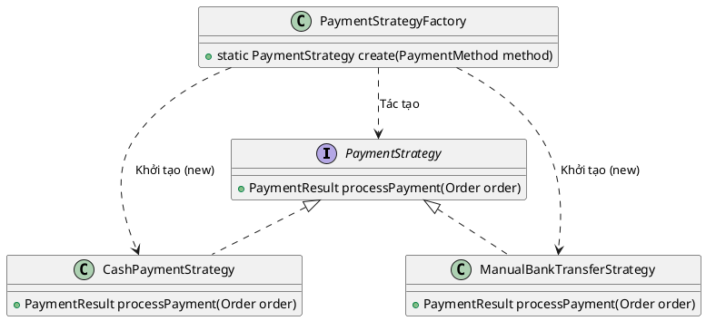

# 2. Simple Factory Pattern

## 1. Mục đích sử dụng
Cung cấp một giao diện (method) để tạo ra các đối tượng (objects) mà không cần để lộ logic khởi tạo ở phía client. Client chỉ cần truyền vào loại mong muốn, Factory sẽ tự động quyết định trả về đối tượng thích hợp.

## 2. Vị trí áp dụng trong hệ thống
Mẫu thiết kế này được sử dụng trong việc khởi tạo các chiến lược thanh toán của module `payment`. Thay vì để người gọi (Controller/Service) phải dùng lệnh `new` để tạo tay từng phương thức thanh toán, chúng ta gói gọn logic đó vào `PaymentStrategyFactory`.

## 3. Cấu trúc lớp
### Các lớp thực tế trong codebase:
- `com.brewpoint.pos.payment.PaymentStrategyFactory`: Lớp Factory chịu trách nhiệm khởi tạo đối tượng.
- `com.brewpoint.pos.model.PaymentMethod`: Enum phân loại (Cash, Manual Bank Transfer).
- Các class chiến lược: `PaymentStrategy` (Interface), `CashPaymentStrategy`, `ManualBankTransferStrategy`.

### Sơ đồ PlantUML:

## 4. Luồng hoạt động
- Khi người dùng thực hiện thanh toán, hệ thống sẽ lấy ra enum `PaymentMethod` (VD: `CASH` hoặc `MANUAL_BANK_TRANSFER`).
- `CheckoutService` gọi hàm tĩnh `PaymentStrategyFactory.create(method)`.
- Bên trong hàm `create`, lệnh `switch` hoặc `if-else` sẽ được dùng để kiểm tra kiểu thanh toán. Nếu là tiền mặt (`CASH`), Factory trả về đối tượng `CashPaymentStrategy`; nếu là chuyển khoản, nó trả về `ManualBankTransferStrategy`.

## 5. Lợi ích đạt được
- **Giấu kín logic khởi tạo:** Người dùng (Client) không cần quan tâm lớp `CashPaymentStrategy` cần tham số gì để khởi tạo, tất cả đã được Factory lo liệu.
- **Tập trung quản lý:** Khi có thêm một phương thức thanh toán mới (như ZaloPay, Momo), lập trình viên chỉ cần tạo class mới và thêm một dòng `case` vào trong Factory mà không phải đi tìm sửa ở nhiều nơi.

## 6. Hạn chế
- **Vi phạm nguyên tắc Open/Closed:** Nếu áp dụng Simple Factory (chỉ dùng `switch-case` hoặc `if-else`), mỗi khi thêm phương thức mới, chúng ta vẫn phải sửa trực tiếp mã nguồn của lớp Factory. (Để khắc phục có thể dùng Abstract Factory hoặc Reflection).

## 7. Danh sách lớp thực tế để generate Class Diagram
Bạn có thể chọn các class sau trong IntelliJ (chuột phải -> Diagrams -> Show Diagram) để công cụ tự động vẽ:
- `com.brewpoint.pos.payment.PaymentStrategyFactory`
- `com.brewpoint.pos.payment.PaymentStrategy`
- `com.brewpoint.pos.payment.CashPaymentStrategy`
- `com.brewpoint.pos.payment.ManualBankTransferStrategy`
- `com.brewpoint.pos.model.PaymentMethod`
- `com.brewpoint.pos.service.CheckoutService` (Client)
