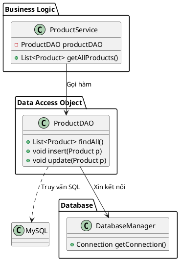

# 3. DAO (Data Access Object) Pattern

## 1. Mục đích sử dụng
Tách biệt hoàn toàn phần logic truy cập dữ liệu (tương tác với cơ sở dữ liệu) ra khỏi phần logic nghiệp vụ (business logic) của hệ thống. 

## 2. Vị trí áp dụng trong hệ thống
Mẫu thiết kế này được sử dụng trên toàn bộ tầng truy xuất dữ liệu của ứng dụng, đặc biệt là trong package `com.brewpoint.pos.dao`. Nó giúp các Service (như `OrderService`, `ProductService`) không cần phải biết cách viết câu lệnh SQL hay cách mở kết nối cơ sở dữ liệu.

## 3. Cấu trúc lớp
### Các lớp thực tế trong codebase:
- Lớp cơ sở: Mặc dù không có interface chung, các DAO trong hệ thống đều tuân thủ nguyên tắc chứa các hàm Create, Read, Update, Delete (CRUD).
- Các lớp DAO cụ thể (Concrete DAOs): `com.brewpoint.pos.dao.CategoryDAO`, `com.brewpoint.pos.dao.ProductDAO`, `com.brewpoint.pos.dao.OrderDAO`, `com.brewpoint.pos.dao.EmployeeDAO`, v.v.

### Sơ đồ PlantUML:

## 4. Luồng hoạt động
- Khi Controller nhận yêu cầu từ người dùng, nó gọi đến Service.
- Service xử lý logic nghiệp vụ, sau đó gọi phương thức của DAO (ví dụ: `productDAO.findAll()`).
- DAO sẽ chịu trách nhiệm giao tiếp với `DatabaseManager` để lấy kết nối, tạo câu lệnh SQL (`PreparedStatement`), thực thi xuống Database, đọc `ResultSet`, ánh xạ dữ liệu thành các object Model (`Product`), và trả lại cho Service.

## 5. Lợi ích đạt được
- **Phân tách trách nhiệm (Separation of Concerns):** Code nghiệp vụ (Service) trở nên rất sạch sẽ vì không chứa bất kì dòng code SQL hay thao tác kết nối JDBC nào.
- **Dễ bảo trì và nâng cấp:** Nếu sau này hệ thống đổi Database (ví dụ từ MySQL sang PostgreSQL hoặc NoSQL), chúng ta chỉ việc sửa code bên trong các class DAO mà không phải đụng tới logic ở các tầng trên.
- **Dễ kiểm thử:** Có thể dễ dàng giả lập (Mock) các lớp DAO để test phần Service mà không cần kết nối tới cơ sở dữ liệu thật.

## 6. Hạn chế
- **Tăng số lượng lớp (class):** Mỗi Model thường sẽ cần thêm một lớp DAO tương ứng, làm tăng tổng số file trong dự án.
- **Có thể gây dư thừa logic:** Với các chức năng quá đơn giản, việc phải truyền dữ liệu qua lại giữa Controller -> Service -> DAO đôi khi mang lại cảm giác rườm rà.

## 7. Danh sách lớp thực tế để generate Class Diagram
Bạn có thể chọn các class sau trong IntelliJ (chuột phải -> Diagrams -> Show Diagram) để công cụ tự động vẽ:
- `com.brewpoint.pos.dao.ProductDAO`
- `com.brewpoint.pos.service.ProductService` (Client)
- `com.brewpoint.pos.model.Product`
