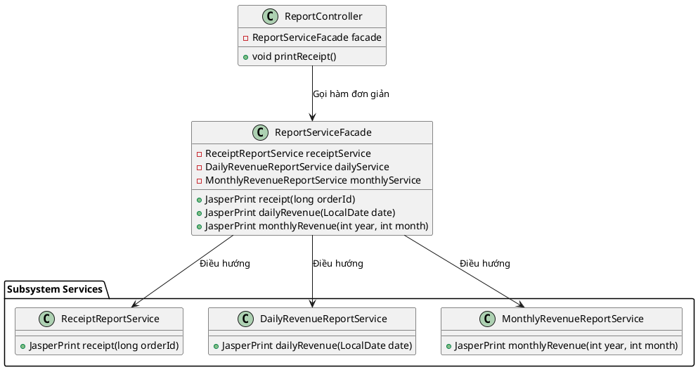

# 4. Facade Pattern

## 1. Mục đích sử dụng
Cung cấp một giao diện hợp nhất (unified interface) duy nhất, đơn giản, đại diện cho một nhóm các giao diện phức tạp của một hệ thống con (subsystem). Facade che giấu sự phức tạp của hệ thống con, giúp Client (bên gọi) dễ dàng tương tác hơn mà không cần biết cách phối hợp các component nhỏ bên trong.

## 2. Vị trí áp dụng trong hệ thống
Áp dụng rõ nét trong module tạo báo cáo (Report). Hệ thống có rất nhiều loại báo cáo khác nhau: Báo cáo hóa đơn, báo cáo doanh thu theo ngày, doanh thu theo tháng, thống kê nhân viên, top sản phẩm. Thay vì bắt `ReportController` phải gọi trực tiếp từng Service nhỏ, ta đóng gói chúng lại vào trong một lớp mặt tiền (Facade).

## 3. Cấu trúc lớp
### Các lớp thực tế trong codebase:
- Lớp Facade: `com.brewpoint.pos.report.service.ReportServiceFacade`
- Các subsystem bị che giấu:
   - `ReceiptReportService`
   - `DailyRevenueReportService`
   - `MonthlyRevenueReportService`
   - `BestSellingProductsReportService`
   - `CashierPerformanceReportService`
- Client: `com.brewpoint.pos.controller.ReportController`

### Sơ đồ PlantUML:

## 4. Luồng hoạt động
- Lớp `ReportController` có nhiệm vụ đáp ứng các sự kiện click nút bấm từ giao diện (View). Thay vì nó phải nhồi nhét, khởi tạo và gọi 5, 6 lớp Service xuất báo cáo khác nhau, nó chỉ cần biết duy nhất `ReportServiceFacade`.
- Lớp `ReportServiceFacade` được truyền vào các lớp dịch vụ con qua Constructor.
- Khi `ReportController` gọi `facade.monthlyRevenue(...)`, Facade sẽ tự nhận nhiệm vụ điều phối và ủy quyền (delegate) tiếp cho `MonthlyRevenueReportService` xử lý logic phức tạp (gọi DAO lấy số liệu, format Jasper, v.v).

## 5. Lợi ích đạt được
- **Giảm sự kết dính (Loose Coupling):** Tách biệt Controller ra khỏi các thành phần xử lý logic con. Nếu có sự thay đổi hoặc chia nhỏ thêm các Service báo cáo, ta chỉ cần cập nhật `ReportServiceFacade` mà không cần đụng đến `ReportController`.
- **Dễ sử dụng:** Cung cấp một API cực kì gọn gàng và dễ hiểu. Lập trình viên phụ trách làm View/Controller không cần phải nghiên cứu hàng chục lớp Service khác nhau, chỉ cần gọi Facade là xong.

## 6. Hạn chế
- **Nguy cơ trở thành "Lớp thần thánh" (God Object):** Lớp Facade có thể bị phình to (bloated) và gắn kết với tất cả mọi lớp của hệ thống con nếu không được kiểm soát tốt, từ đó vi phạm nguyên tắc Single Responsibility.

## 7. Danh sách lớp thực tế để generate Class Diagram
Bạn có thể chọn các class sau trong IntelliJ (chuột phải -> Diagrams -> Show Diagram) để công cụ tự động vẽ:
- `com.brewpoint.pos.report.service.ReportServiceFacade`
- `com.brewpoint.pos.report.service.ReceiptReportService`
- `com.brewpoint.pos.report.service.DailyRevenueReportService`
- `com.brewpoint.pos.report.service.MonthlyRevenueReportService`
- `com.brewpoint.pos.report.service.BestSellingProductsReportService`
- `com.brewpoint.pos.report.service.CashierPerformanceReportService`
- `com.brewpoint.pos.controller.ReportController` (Client)
