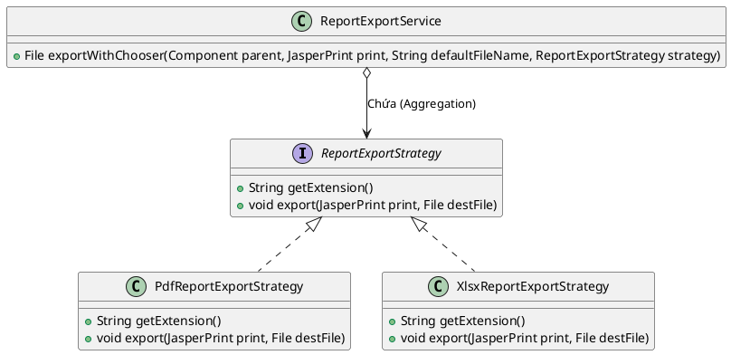

# 5. Strategy Pattern

## 1. Mục đích sử dụng
Định nghĩa một tập hợp các thuật toán/chiến lược, đóng gói từng thuật toán lại và làm cho chúng có thể hoán đổi cho nhau. Mẫu thiết kế này cho phép thuật toán có thể thay đổi độc lập với các Client (người sử dụng thuật toán).

## 2. Vị trí áp dụng trong hệ thống
Strategy được áp dụng rất rõ rệt ở hai nơi trong ứng dụng:
1. **Thanh toán (`payment`):** Cho phép thay đổi giữa thanh toán tiền mặt và chuyển khoản.
2. **Xuất báo cáo (`report.exporter`):** Cho phép hoán đổi thuật toán xuất định dạng file từ PDF, XLSX sang DOCX.

## 3. Cấu trúc lớp
### Các lớp thực tế trong codebase:
**Tình huống xuất báo cáo (Report Exporter):**
- Interface chiến lược: `com.brewpoint.pos.report.exporter.ReportExportStrategy`
- Các chiến lược cụ thể: 
   - `PdfReportExportStrategy`
   - `XlsxReportExportStrategy`
   - `DocxReportExportStrategy`
- Context sử dụng: `com.brewpoint.pos.report.exporter.ReportExportService`

### Sơ đồ PlantUML (Report Exporter):

## 4. Luồng hoạt động
- Lớp `ReportExportService` có một phương thức để thực thi việc xuất báo cáo, tuy nhiên nó không tự quy định cách xuất (không có lệnh if-else định dạng).
- Thay vào đó, nó nhận vào tham số là một `ReportExportStrategy`.
- Khi người dùng bấm nút "Xuất PDF", Controller sẽ truyền `PdfReportExportStrategy` cho `ReportExportService`. Nếu muốn xuất Excel, nó truyền `XlsxReportExportStrategy`. Phương thức `export()` tương ứng trong chiến lược sẽ được gọi để xử lý theo đúng thuật toán mong muốn.

## 5. Lợi ích đạt được
- **Loại bỏ các cấu trúc if/else dài dòng:** Logic của mỗi phương thức xuất báo cáo (hoặc thanh toán) được viết riêng rẽ, không bị nhồi chung vào một class duy nhất.
- **Dễ dàng mở rộng:** Nếu tương lai hệ thống muốn xuất thêm định dạng `.CSV`, chỉ cần tạo thêm `CsvReportExportStrategy` triển khai `ReportExportStrategy` mà không cần phải sửa đổi `ReportExportService` (Tuân thủ nguyên tắc Open/Closed).

## 6. Hạn chế
- Số lượng class trong project sẽ tăng lên do mỗi thuật toán/chiến lược phải đứng riêng thành một class.
- Client (Controller) buộc phải biết sự tồn tại của các chiến lược khác nhau để quyết định sẽ truyền chiến lược nào cho Service.

## 7. Danh sách lớp thực tế để generate Class Diagram
Bạn có thể chọn các class sau trong IntelliJ (chuột phải -> Diagrams -> Show Diagram) để công cụ tự động vẽ:
- `com.brewpoint.pos.report.exporter.ReportExportStrategy`
- `com.brewpoint.pos.report.exporter.PdfReportExportStrategy`
- `com.brewpoint.pos.report.exporter.XlsxReportExportStrategy`
- `com.brewpoint.pos.report.exporter.DocxReportExportStrategy`
- `com.brewpoint.pos.report.exporter.ReportExportService` (Context)
- `com.brewpoint.pos.controller.ReportController` (Client)
