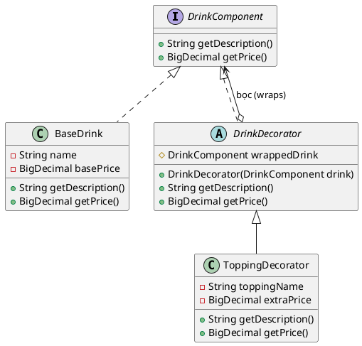

# 6. Decorator Pattern

## 1. Mục đích sử dụng
Cho phép gắn (attach) thêm trách nhiệm/tính năng mới cho một đối tượng (object) vào thời điểm chạy (runtime) một cách linh hoạt, thay vì sử dụng kế thừa tĩnh (static inheritance) với các lớp con. Decorator đóng vai trò như một "lớp vỏ" bọc lấy đối tượng cốt lõi.

## 2. Vị trí áp dụng trong hệ thống
Mẫu thiết kế này được sử dụng xuất sắc trong module tính giá đồ uống (`pricing`). Khi một ly nước cơ bản được khách hàng order thêm nhiều loại topping khác nhau (như trân châu, pudding, thạch), hệ thống dùng Decorator để "bọc" các topping này lên ly nước gốc, nhằm tính lại tổng giá trị cuối cùng.

## 3. Cấu trúc lớp
### Các lớp thực tế trong codebase:
- Interface gốc: `com.brewpoint.pos.pricing.DrinkComponent`
- Lớp đồ uống cơ bản (Concrete Component): `com.brewpoint.pos.pricing.BaseDrink`
- Lớp vỏ Decorator (Base Decorator): `com.brewpoint.pos.pricing.DrinkDecorator`
- Lớp vỏ Decorator cụ thể (Concrete Decorator): `com.brewpoint.pos.pricing.ToppingDecorator`
- Vị trí sử dụng: Logic này được dùng trong class giao diện `com.brewpoint.pos.view.ProductOptionDialog` (Hàm `updatePreview()`).

### Sơ đồ PlantUML:

## 4. Luồng hoạt động
- Đầu tiên, một đối tượng đồ uống gốc được tạo ra: `DrinkComponent drink = new BaseDrink("Trà sữa", "L", 40000);`
- Nếu người dùng chọn topping, hệ thống sẽ lấy đối tượng gốc bọc vào một lớp vỏ: `drink = new ToppingDecorator(drink, "Trân châu đen", 10000);`
- Quá trình "bọc" có thể lặp đi lặp lại nhiều lần nếu người dùng chọn nhiều topping.
- Cuối cùng, khi gọi hàm `drink.getPrice()`, lời gọi hàm sẽ được truyền đệ quy qua các lớp vỏ (các topping sẽ cộng dồn giá tiền của nó vào giá của đồ uống bên trong), trả ra tổng tiền chính xác.

## 5. Lợi ích đạt được
- **Giải quyết tình trạng bùng nổ lớp con (Subclass Explosion):** Tránh việc phải tạo ra hàng tá lớp thừa thãi như `TraSuaTranChauDen`, `TraSuaPudding`, `TraSuaTranChauPudding`... Bằng Decorator, chúng muốn kết hợp linh hoạt chúng vào lúc chạy ứng dụng.
- **Tuân thủ Single Responsibility:** Chia nhỏ từng loại topping thành một decorator riêng biệt, đồ uống cơ bản có trách nhiệm tính giá đồ uống cơ bản.

## 6. Hạn chế
- Việc tạo ra nhiều đối tượng bọc nhau khiến mã nguồn (code) có thể hơi khó hiểu và "lắt léo" khi cố gỡ lỗi (debug), vì khi in ra đối tượng ta chỉ thấy lớp vỏ ngoài cùng.
- Nếu không tổ chức tốt, số lượng đối tượng sinh ra trong bộ nhớ ở runtime (khi khách chọn quá nhiều topping) sẽ tăng lên.

## 7. Danh sách lớp thực tế để generate Class Diagram
Bạn có thể chọn các class sau trong IntelliJ (chuột phải -> Diagrams -> Show Diagram) để công cụ tự động vẽ:
- `com.brewpoint.pos.pricing.DrinkComponent`
- `com.brewpoint.pos.pricing.BaseDrink`
- `com.brewpoint.pos.pricing.DrinkDecorator`
- `com.brewpoint.pos.pricing.ToppingDecorator`
- `com.brewpoint.pos.view.ProductOptionDialog` (Client)
