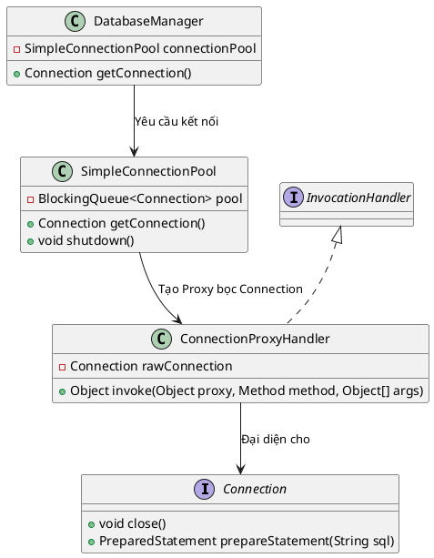

# 7. Object Pool Pattern

## 1. Mục đích sử dụng
Quản lý và tái sử dụng một tập hợp (pool) các đối tượng đã được khởi tạo sẵn thay vì tạo mới và hủy chúng liên tục. Mẫu thiết kế này đặc biệt hữu ích khi việc khởi tạo một đối tượng tiêu tốn rất nhiều tài nguyên hoặc thời gian (ví dụ: kết nối cơ sở dữ liệu, luồng - thread).

## 2. Vị trí áp dụng trong hệ thống
Áp dụng tại tầng cơ sở dữ liệu (`database`). Hệ thống tự triển khai một Pool kết nối cơ sở dữ liệu để tái sử dụng các `java.sql.Connection` thông qua lớp `SimpleConnectionPool`, thay vì mỗi lần tương tác với DB lại phải tốn chi phí gọi `DriverManager.getConnection()`.

## 3. Cấu trúc lớp
### Các lớp thực tế trong codebase:
- Lớp Object Pool: `com.brewpoint.pos.database.SimpleConnectionPool`
- Lớp Proxy (ẩn bên trong): `ConnectionProxyHandler` (dùng để đánh chặn lệnh `close()`)
- Đối tượng được tái sử dụng: `java.sql.Connection`
- Client sử dụng: `com.brewpoint.pos.database.DatabaseManager` (khởi tạo và gọi pool)

### Sơ đồ PlantUML:

## 4. Luồng hoạt động
- **Khởi tạo (Eager Initialization):** Khi `SimpleConnectionPool` được tạo, nó thiết lập trước một số lượng kết nối vật lý cố định (poolSize) và bỏ vào hàng đợi `BlockingQueue`.
- **Cấp phát:** Khi `DatabaseManager` xin kết nối (`getConnection`), Pool không tạo mới mà lấy một Connection có sẵn từ trong hàng đợi ra.
- **Sử dụng Proxy:** Để ngăn chặn lập trình viên vô tình đóng mất kết nối vật lý, Pool bọc Connection thật vào một `ConnectionProxyHandler` (Sử dụng Dynamic Proxy của Java). 
- **Hoàn trả:** Khi các lớp DAO dùng xong và gọi lệnh `connection.close()`, Proxy sẽ chặn lệnh này lại, không gọi hàm close thật của DB mà thay vào đó sẽ trả (offer) Connection này ngược lại vào hàng đợi để các lượt truy cập sau tiếp tục sử dụng.

## 5. Lợi ích đạt được
- **Tăng hiệu năng rệt:** Loại bỏ hoàn toàn độ trễ do chi phí thiết lập kết nối mạng TCP/IP và chứng thực với hệ quản trị cơ sở dữ liệu trong mỗi lần truy vấn.
- **Kiểm soát tài nguyên:** Giới hạn số lượng kết nối tối đa mở vào DB cùng lúc (pool size), tránh tình trạng quá tải DB (Too many connections) khi hệ thống chịu tải cao.

## 6. Hạn chế
- **Phức tạp hơn trong thiết kế:** Phải xử lý vấn đề đa luồng (multi-threading) một cách cẩn thận (trong project đã dùng `LinkedBlockingQueue` để an toàn luồng).
- **Trạng thái đối tượng "bẩn":** Nếu không dọn dẹp kết nối cẩn thận trước khi trả về Pool (VD: quên commit/rollback transaction), người dùng tiếp theo có thể kế thừa một trạng thái sai lệch.

## 7. Danh sách lớp thực tế để generate Class Diagram
Bạn có thể chọn các class sau trong IntelliJ (chuột phải -> Diagrams -> Show Diagram) để công cụ tự động vẽ:
- `com.brewpoint.pos.database.SimpleConnectionPool`
- `com.brewpoint.pos.database.DatabaseManager` (Client)
- `java.sql.Connection`
